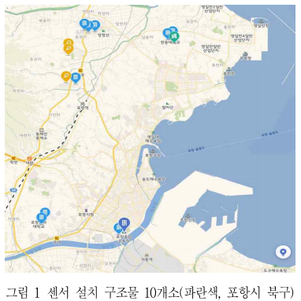
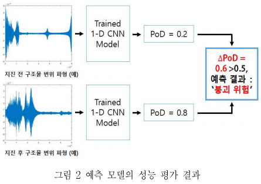
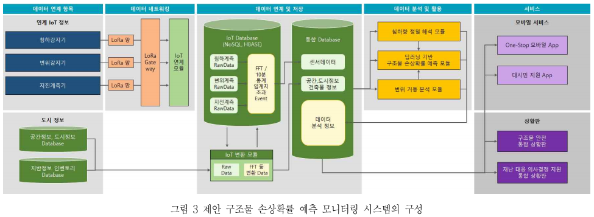

# 2020.09.22 논문 리뷰

```
논문: A PoD(Probability of Damage) Prediction Monitoring System for Structure Safety based-on Deep Learning
저자: Euihan Jeong, Gyeongyeong Kim, Youngjoo Suh, Kyungjun Ki
```

## 요약

```
1-D CNN 모델을 이용해 구조물 건전성 모니터링(SHM, Structral Health Monitoring)을 수행하고,
SHM에 IoT를 결합하여 딥러닝 기반 구조물 손상확률(PoD, Probability of damage) 예측 시스템을 제안.

1-D CNN 모델을 활용한 구조물 손상확률 예측 모델.
... 구조물 센서 데이터를 프레임 단위로 나누어 예측 속도를 빠르게 수행,
... 전체 프레임들의 손상확률 평균으로 예측 정확도를 개선.

제안한 시스템은 구조물 유지 보수에 대한 의사결정 지원 및 사전 경보.
... 지진과 같은 재난으로부터 발생하는 피해를 최소화하는 분야에 적용 가능.
```

## 1. Introduction

```
과거의 구조물 건전성 평가.
... 많은 시간과 이에 따른 추가 비용 필요.
... 특히 평가기간: 구조물 패쇄로 상당한 경제적 손실 발생.

구조물 붕괴 위험도(PoD)를 판단하기 위해 구조물 건정성 모니터링(SHM)을 이용한 예측 시스템을 제안.
... 우선 구조물에 센서값(가속도센서, 기울기센서)을 수집, 데이터셋을 구축.
... 딥러닝 기반의 예측 모델을 이용해 손상확률(PoD)을 예측.
... 예측한 손상확률을 통해 구조물의 붕괴 위험도 판단.
... 모바일 서비스 및 상황판과 연계하여 관리자와 시민들에게 공유, 전파.

딥러닝 기반 구조물 안전을 위한 손상확률 예측 모니터링 시스템.
... 평상시: 구조물의 손상 및 노후화 정도를 파악하여 유지보수에 대한 의사결정 지원.
... 지진 등의 재난: 구조물 붕괴 위험도 예측을 통해 피해 규모와 그 범위를 줄일 수 있을 것으로 기대.
```

## 2. 구조물 손상확률 예측 시스템

### 1) 구조물 센서 데이터셋 구축



```
구조물 손상 예측용 데이터 수집.
... 다수가 이용하는 공공시설이나 2017년 포항 지진 피해가 있던 구조물 등을 대상으로 10개 건물 선정.
... 건물별 침하감지기 2개, 지진 가속도 1개, 기울기 1개씩 총 40개의 센서를 설치하여 데이터를 수집.

다만 센서 데이터는 안전한 상태의 데이터가 대부분.
... 위험한 상태의 데이터가 상대적으로 부족한 상황.
... 위험한 상태의 데이터는 손상 및 노후화 정도가 심한 건물에서 수집, 재난 발생시 추가 수집이 필요.
... 위험한 상태의 데이터가 적어 분석에 어려움이 있음.

재난 데이터의 확보를 위해서 2019년부터 포항시 북구에 지진관측소를 구축하여 데이터를 수집 중.
2021년까지 1개 이상의 지진 관측소를 추가 구축할 예정.
... 지진관측소에서 수집한 데이터를 바탕으로 평상시와 지진 발생시의 데이터를 비교 분석하여 가상으로 생성할 예정.
```

### 2) 구조물 손상확률 예측 모델



```
기존의 방식: 규칙 기반(Rule-based) 방식 및 통계적 방식.
... 문제점: 예측 정확도가 낮고 예측 속도가 느린 문제.

전통적인 CNN 방식.
... 데이터의 질에 따라 정확도가 많이 달라지고, 아주 많은 데이터가 필요한 단점.

이 문제들을 개선하기 위해 적은 데이터로도 노픙ㄴ 정확도를 얻을 수 있는 1-D CNN 모델을 이용.
... 아주 안전한 구조물과 아주 위험한 구조물의 데이터로 학습하여 손상확률을 예측.
... 데이터셋을 프레임 단위로 나누어 예측 속도를 높임.
... 전체 프레임들의 손상확률 평균으로 결과를 산출하여 예측 정확도를 높임.

그림 2: 예측 모델의 성능 평가 결과.
... 지진 전: 구조물의 PoD가 낮아 안전한 구조물로 판단.
... 지진 후: 구조물의 PoD가 높아 붕괴 위험 구조물로 판단.
```

### 3) 구조물 건전성 모니터링을 이용한 예측 시스템



```
그림 3의 구조물 손상확률 에측 시스템 구성 = 구조물 건전성 모니터링 + IoT를 결합.
... 구조물 센서: 센서값을 획득하여 데이터베이스에 전달.
... 데이터베이스: 전달받은 센서값으로 데이터셋을 구축, 구조물 손상확률 예측모델에 전달.
... 예측 모델: 손상확률 에측, 평상시 PoD가 기준치 이상이면 손상 및 노후화 구조물로 판단, 평상시와 재난 발생시 PoD 차가 크다면 재난 발생 시 붕괴 위험 구조물로 판단.
... 모바일 서비스 및 상황판: 구조물 관리자 및 시민들에게 공유 전파.
```