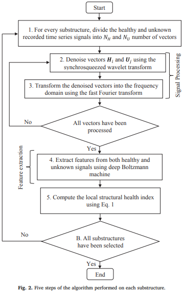
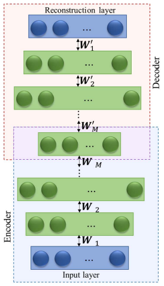
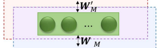
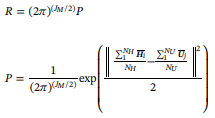
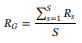
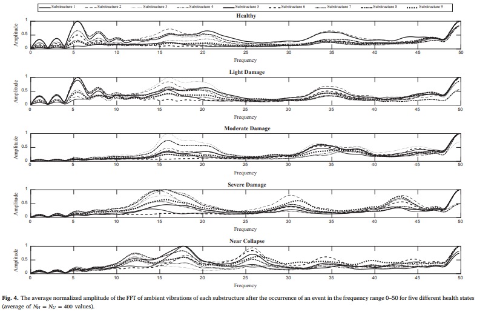

# 2020.09.22 논문 리뷰

```
논문: A novel unsupervised deep learning model for global and local health condition assessment of structures
저자: Mohammad Hossein Rafieia, Hojjat Adelib
```

## 요약

```
구조물의 진동 기반 구조 건강 상태 평가를 위한 새로운 모델.
synchrosqueezed wavelet transform, FFT(Fast Fourier Transform), deep Boltzmann machine을 통합.
전반적인, 지역적인 건강상태를 평가하기 위한 새로운 구조적 건강지수
구조의 추소버전에서 값비싼 실험 결과가 필요 없음.
확장된 38층 RC 건물에서 얻은 데이터를 사용하여 설명.
```

## 1. Introduction and literature review

```
본 논문에서는 센서에 의해 수집된 구조의 구변진동 응답 데이터를 사용하여 구조 시스템의 전역 및 국부적인 평가를 위해 새로운 unsupervised learning 모델을 제시.
이 모델은 SWT을 사용해 측정된 신호를 제거하고 신호의 주파수 도메인에서 feature 추출 하기위해 unsupervised deep RBM을 사용.
이 연구에서 사용된 확률 밀도 함수는 Bayesian 추론의 개념에서 파생됨. 여기서 다른 기록이 주이진 새로운 기록의 조건부 확률이 계산됨.
조건부 확률은 통계에서 우도(likelihood)로 알려준 두 레코드의 유사성을 다룸.
제안된 모델의 효과는 저자의 초기연구에 사용된 3D 1:2 스케일 38층 철근 콘크리트 건축 구조물에서 얻은 데이터를 사용하여 설명됨.
```

## 2. Proposed algorithm

### 2.1. Requirements of the model

```
저자의 최근 모델과 달리, 제안된 모델은 스케일된 구조 버전의 손상 시뮬레이션을 필요로 하지 않음.

입력 = 정상 상태에서 얻은 레코드 집합 + 알 수 없는 상태에 있는 다른 레코드 집합
... 정상 상태의 레코드: 건강한 상태의 적어도 한 평면 방향의 시계열 신호형태로 바람, 교통, 사람의 활동에 의한 주변 진동.

이런 진동은 일반적으로 고층 건물 구조의 바닥과 같이 미리 선택된 위치에 몇개의 센서를 배치하여 기록.

구조물 S는 9개의 하부 구조물(S_1, S_2, ..., S_9)으로 나뉨.
... 하부 구조물은 적어도 한 층에 센서가 있어야함.
... 하부 구조물 및 센서의 위치 최적 선택은 구조물 시슽메 식별 및 건강 모니터링 분야의 중요한 문제이지만 이 논문의 범위 밖.

건강한 상태에 대한 주변 진동이 없는 경우 확률 이론을 사용하여 계산 가능.
```

### 2.2. Five steps performed on each substructure to calculate the local SHI.

```
제안된 모델은 5가지 단계로 이루어짐.
```



- Step 1. 샘플링

```
T_H 시간 동안, 주파수 F_H(Hz)를 샘플링: 총 T_H * F_H 개의 서로 다른 signal points.
... 하부 구조에 대응하는 부분: 기록된 가속도를 N_H 벡터로 분할.
... H_i (i = 1, 2, ..., N_H), 각각이 L = (T_H * F_H) / N_H를 가지며 하부 구조물의 건정성 정보를 가짐.

T_U 시간 동안, 주파수 F_U(Hz)를 샘플링: 총 T_U * F_U 개의 서로 다른 signal points.
... 하부 구조에 대응하는 부분: 기록된 가속도를 N_U 벡터로 분할.
... U_j (j = 1, 2, ..., N_U), 각각이 L = (T_U * F_U) / N_U를 가지며 하부 구조물 unkown 상태 정보를 가짐.

일반적으로 N_H == N_U, T_H == T_U, 그리고 F_H == F_U.
... 그렇지 않다면, N_H과 N_U 대신 L을 선택.
... 가정:  N_H, N_U의 적절한 선택으로 L은 충분히 많은 특징을 가지고, 하부 구조의 건강/손상을 정확히 표현하기 위한 모든 H_i와 U_j에서 추적 가능하도록 충분히 큼.

만일 N_H와 N_U가 L을 너무도 크게 만드는 값으로 선택 된다면.
... H_i, U_j: 건강/손상 상태의 정확학 표현을 위해 불필요한 여분의 특징들도 포함할 수 이씅ㅁ.
... 이런 현상은 feature 추출 작업을 어렵게 만듦. 

하지만 시뮬레이션 결과, 모델이 L의 크기 변화에 매우 민감하지 않음을 확인함.
```

- Step 2. SWT

```
SWT를 이용해 H_i, U_j 벡터의 노이즈를 제거.
... SWT: 매우 강력한 wavelet transform, discrete wavelet packet transform.

synchrosqueeze mapping operation: time-frequency 도메인에서 scale과 time offsets을 계산.
... time 도메인의 shpar points에서 보다 나은 reconstruction을 보임.
```

- Step 3. FFT

```
FFT, Fast Fourier Transform을 통해 노이즈가 제거된 Healthy, Unknown 벡터를 frequency로 매핑.
... 보다 중요한 정보에 접근할 수 있게함.
```

- Step 4. DRBM

```
FFT에의해 denoised된 Healthy와 Unkown 벡터를 DRBM의 입력으로 사용한다.

DRBM: feature 추출을 위한 encoder + decoder
```



```
Encoder = 몇 층의 RBM, Restricted Boltzmann machine.
... 각 layer: 이전 layer의 결과를 받아 feature 추출.
... 일반적으로 layer가 쌓일수록 정교한 feature를 추출하지만 그만큼 시간을 소요한다.
... 문제에 따라 성능/시간의 trade-off가 결정되니 실험적으로 찾아야 한다.

Decoder = Encoder와 대칭적(Symmetric).

RBM: Encoder layer와 Decoder layer의 2-layer interconneted NN.
... input과 hidden layer들이 L*J 크기의 가중치 W를 서로 공유하면서 연결됨 ... J: hidden layer의 node 개수.
... layer 내 뉴런간 intera-connection이 없음.
... feature 추출: constructive divergence.
```



```
Encoder에서 m번째 RBM에 해당하는 Weight W_m: L*J_m 행렬.
... m {1, 2, ..., M}, M: Encoder 내 히든레이어의 총 개수.
... J_m: Encoder 내 mth layer의 node 개수.

Decoder에서의 Weight: 대응하는 Encoder layer의 W^T
Decoder의 마지막 layer: reconstruction layer.

Hinton & Salakhutdino의 알고리즘: 효과적인 RDB pre-training 과정.
```

- Step 5. local SHI

```
아래의 식으로 확률 밀도 함수의 개념으로 하부 구조물의 local SHI 계산.

R: local SHI.
P: 확률 밀도 함수.
```



```
H_bar_i, U_bar_j: H_i, U_j에 대응하는 last layer의 hidden node 값
... Healthy, Unkown state의 추출된 feature을 표현.

아래 식을 통해 N_H, N_U 내 모든 element가 정규화됨.
... avg = 0, standard deviation = 1.
```


```
추출된 Hidden feature들을 통한 보정 평균: P는 평균 확률 밀도 함수.
... 건전한 구조물일 수록 unknown 신호가 healthy 신호와 비슷할 확률이 높음을 나타냄.
... (2*pi)^(J_M/2) term: SHI를 0 - 1로 정규화: 1에 가까울 수록 건전한 구조물임을 표현함. 
```

### 2.3. Global SHI



```
Global SHI = 하부 구조물의 local SHI들의 평균.
... R_s : s번째 하부 구조물.
```

## 3. Example application

### 3.1. Example and damage description

```
저자의 초기연구에 사용된 3D 1:2 스케일 38층 철근 콘크리트 건축 구조물에서 얻은 데이터를 사용.
... podium floors 3층/residential floors 35층/machine floors 4층
... ambient/moderate/large/very large 4단계의 earthquake를 실험.
... 9개의 하부 구조물, 27개의 가속도 측정기: 4, 10, 15, 21, 25, 30, 34, 38층에서/south-north(X 방향), east-west(Y 방향)을 측정.

실험 방법.
ambient vibration: healty state ... wind, traffic, human activity, ...
minor/moderate/strong/very strong earthquake
ambient vibration again.
... 모델은 이 변화를 확인하고 damage level과 SHI를 계산.

Damage level.
light damage: minor earthequake ... very small cracks on structural members.
moderate damage: moderate earthquake ... increased cracks on structural members.
severe damage: strong earthquake ... 50 new crakcks in & non structural members.
near-copllapse: very strong earthquake ... structural members separation.
```

- 실험 결과



```
각 damage 전, 후의 ambient vibrations은 9개의 하부 구조물을 그려내는데 사용됐다.
sampling freq. F_H == F_U == 100Hz, sampling time T_H == T_U == 200s: Healthy, Unknown 데이터 각각 20,000개.
N_H == N_U == 400
... Healthy, Unknown 벡터의 크기 L = (200*100)/400 = 50.

fig 4: 하부 구조물의 FFT 평균 정규화 진폭.
... small variation: healthy state

DRBM: 구조물의 damage level의 신호를 추출.

Damage level에 따른 Global SHI 관측값.
... light damabe(A): 0.89-0.96.
... moderate damage(B): 0.44-0.72
... severe damage(C): 0.03-0.26
... near-collapse damage(D): 0.02-0.25

저자가 정리한 damge category.
... 0.89–0.99 for A
... 0.73–0.88 for A/B
... 0.44–0.72 for B
... 0.26–0.43 for B/C
... and 0.00–0.25 for C/D

```

