# 2020.09.23 논문 리뷰

```
논문: DAMAGE DETECTION OF TRUSS STRUCTURES BY APPLYING MACHINE LEARNING ALGORITHMS 
저자: Koji Unno, Atsushi Mikami, and Masaki Shimizu
```

## 관련연구

```
본 논문 저자 중심.

Damage Detection of Truss Structures Based on Vibration Characteristics(2018).
... 진동 기반의 Truss 구조물 파손 탐지 연구.
```

## 배경지식

- 자기회귀 모델(AutoRegressive model)

```
변수의 과거 값의 선형 조합을 이용해 관심있는 변수를 예측.

차수 p의 자귀회귀 모델은 다음과 같이 쓸 수 있다.
... AR(p) 모델: p 자기회귀 모델 ... p개의 과거 값으로 다음 값을 예측하는 모델.
... ε_t: 백색잡음(White noise).
... y_t의 시차 값을 예측변수(predictor)로 다루는 것만 제외하면 다중회귀와 같음.
```

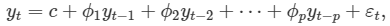

```
자기회귀 모델은 다양한 종류의 서로 다른 시계열 패턴을 매우 유연히 다룰 수 있음.

아래는 AR(1) 모델과 AR(2) 모델로 얻은 시계열.
... 매개변수 ϕ_1, …, ϕ_p: 시계열 패턴을 표현.
... 오차항 ε_t: 시계열의 평행이동.
```

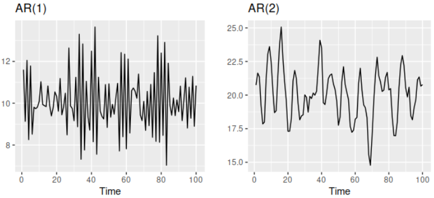

```
AR(1) 모델, y_t = c + ϕ_1y_1 + ε_1은,
... ϕ_1 = 0일때, y_t는 백색잡음(ε_t)와 같다.
... ϕ_1 = 1이고 c = 0일 때, y_t는 확률보행 모델과 같다.
... ϕ_1 = 1이고 c ≠ 0일 때, y_t는 표류가 있는 확률보행 모델과 같다.
... ϕ_1 < 0일때, y_t는 평균값을 중심으로 진동하는 경향.

보통 자기회귀 모델은 정상성을 나타내는 데이터에만 사용.
... 정상성?: 시계열의 확률적인 성질들이 시간의 흐름에 따라 변하지 않는다는 것.
... 시계열의 확률적인 성질들?: 시간(x축)에 따른 평균과 분산.
정상성을 나타내는 경우에 매개변수 값에 몇몇 제한조건이 필요.
... AR(1) 모델의 경우, -1 < ϕ_1 < 1.
... AR(2) 모델의 경우, -1 < ϕ_2 < 1, ϕ_1 + ϕ_2 < 1, ϕ_2 - ϕ_1 < 1.
... p ≥ 3의 경우, 보다 복잡한 제한조건: 데이터분석 프로그램에서 제한조건을 처리.
```

## 연구배경 및 목적

```
센서 데이터 기반 고유값(eigenvalue) 분석.
... 일본 구조물 노후화 속도 > 일본 정비공 수 증가 속도.
... 센서 데이터 기반 구조물 파손 탐지 접근 연구가 증가 중.

ML 기반 파손 탐지.
... Truss형 다리 구조물의 진동 측정 후, 자기회귀 모델로 파손 탐지.
... 파손 구조물의 특징을 담고 있는 AR 계수들에 Decision Tree를 사용해서 파손 여부 판단.
```

## 제안 방법

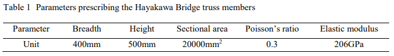

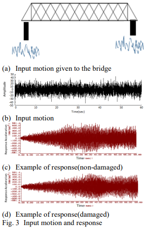

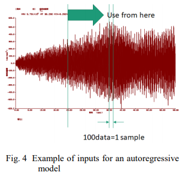

```
실험 구조물의 motion에 따른 damaged/non-damaged 파형 추출.
100개의 데이터를 1개의 sample로 두고 자기회귀 모델 분석 수행.
파손 모델의 특징을 담는 자기모델 계수를 의사결정나무 분석 수행.
```


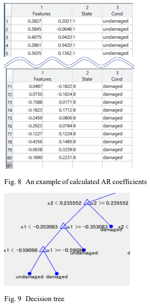

## 모델 및 데이터셋

### 데이터셋

- damaged/non-damaged 데이터셋 구축


```
일본 내 평균적인 연식의 Hakone Tozan Railway에 대한 실험값으로 데이터셋 구축.
random input motion(0.01 간격으로 60초 동안, 총 6000개의 데이터)에 대한 가속도측정 값으로 DB구축.
... damaged 구조물에 대해서/ non-damaged 구조물에 대해서 모두 수행.
... damaged 구조물: 손상 10% ~ 90%으로 나눠서 측정.
```

- 자기회귀 모델 입력 구축


```
random input motion(6000개) 입력으로 얻은 damaged/non-damaged 출력(각 6000개)에 대해, 4000개의 data point를 추출.
각 datapoint를 40 section으로 구분.
damaged/non-damaged datapoint를 자기회귀 모델로 입력.
```

- 의사결정나무 모델 입력 구축

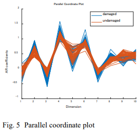

```
damaged/non-damaged datapoint의 특징을 담은 AR 계수를 의사결정나무 모델 입력으로 사용.
AR 계수에 중요하지 않은 계수도 포함되기에 PCA를 통해 입력 차수를 낮춤.
```

### 모델

- 자기회귀 모델(AR model)

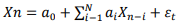

```
N = 10: 10차 자기회귀 모델.

사용된 데이터는 damaged와 non-damaged를 모두 사용.
... damaged, non-damaged 특징을 모두 담은 AR 계수를 추출.
```

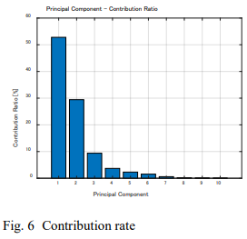

```
damage와 non-damaged AR 계수를 통해 10개의 mode에 대한 기여도를 확인.
mode가 복잡해질수록 AR 계수의 기여도가 떨어짐 ... 본 논문은 1, 2 mode에 집중하게 됨.
```

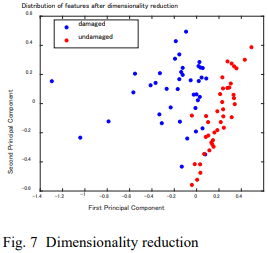

```
fig 7: PCA를 통해 2차원으로 차수를 낮춘 AR 계수들의 분포.
... 명백하게 두그룹으로 나뉨을 확인할 수 있다.
```

- 의사결정나무 모델(Decision tree model)


## 결론 및 추후논문

### 결론

```
의사결정나무 모델의  Threshold값을 통해 damaged/non-damaged 구조물을 구분할 수 있음을 확인함.
... Uppder chord memeber/Diagonal member/Bottom chord member에 대해 모두 확인.
```

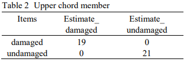

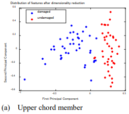

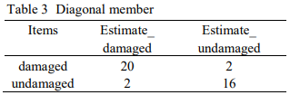

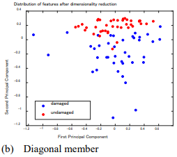

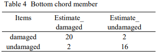

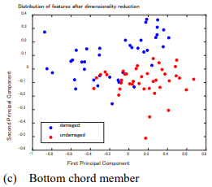

- 파손수준(10~90%)과 데이터 분류의 관계

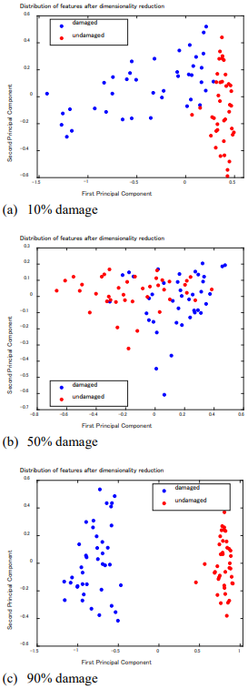

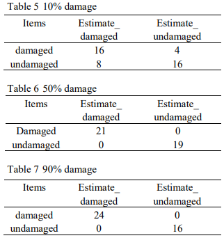

```
파손수준이 낮아질수록 구조물 파손여부 분류가 어려워짐을 확인.
```

- 결론

```
ML(자기회귀 모델, 의사결정나무 모델) 기술로 구조물의 파손여부 판단을 잘 수행할 수 있음을 확인.

이 기술로 연식이 된 Truss 구조물의 파손을 보다 값싸고 간단하게 탐지할 수 있을 것을 기대.
```
