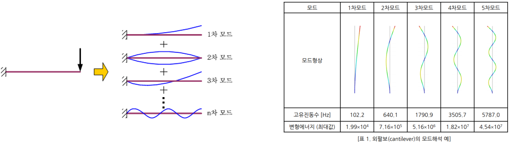
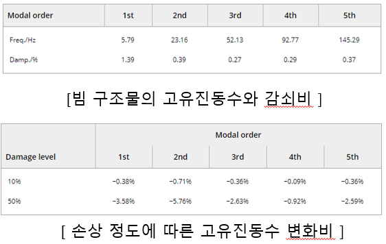
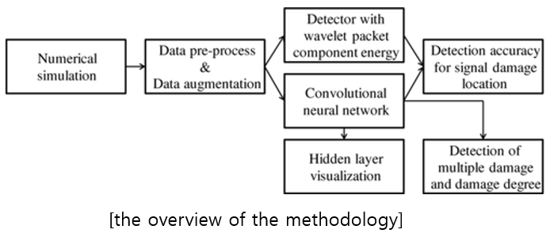
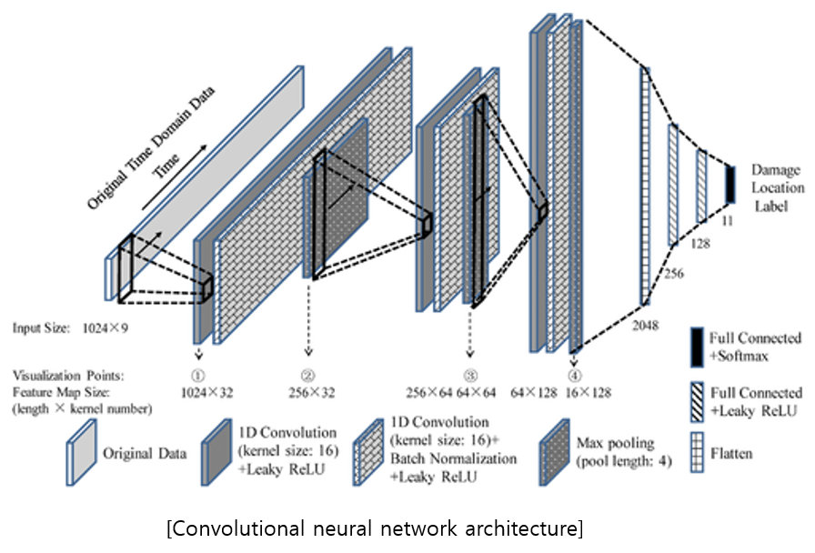
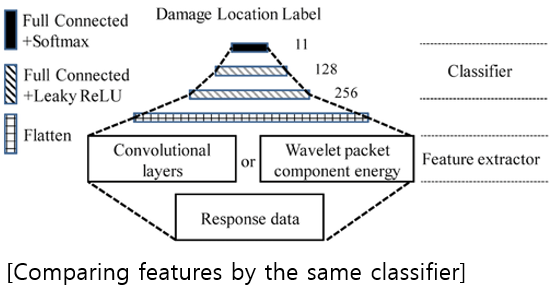
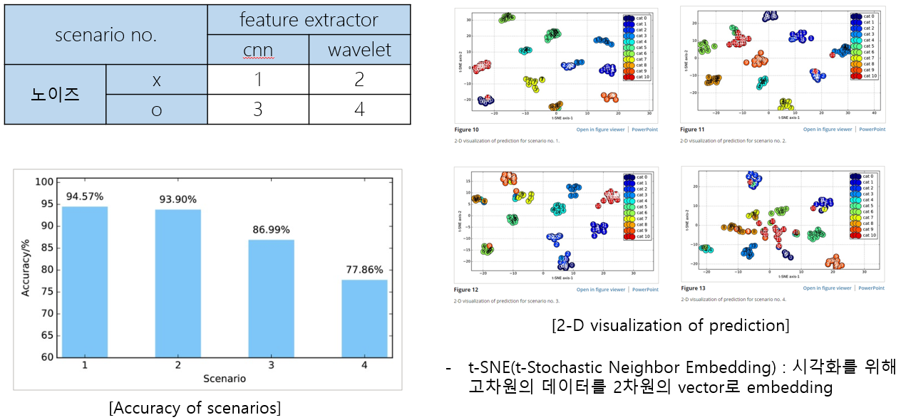

# 2020.09.22 논문 리뷰

```
논문: Structural Damage Detection with Automatic Feature-Extraction through Deep Learning
저자: Yi-zhou Lin & Zhen-hua Nie & Hong-wei Ma
```

## 관련연구

```
본 논문 저자 중심.

Physical interpretation of principal component analysis for structural dynamics through string vibration(May 2019): 진동 데이터 기반의 deep learning model을 해석하기 위한 연구.
```

## 배경지식



```
모드해석(Modal Analysis): 구조물이 갖고 있는 고유진동수와 각 고유진동수에서의 모드 형상(mode shape)을 파악하여 구조물의 공진여부와 진동에 의한 변형형상을 예측하는 해석.

고유진동수(Natural Frequency): 단위시간당 진동하는 횟수, 구조물의 동적 특성을 표현하는 가장 대표적인 개념.

모드형상(Mode Shape).
... 각 고유진동수에서 구조물의 변형형상. 즉, 진동하는 형상을 의미. 무한개의 고유모드가 존재.
... 역학적인 관점에서 1차모드의 모드형상이 최소 변형에너지(strain energy)를 갖는 형상이므로 가장 쉽게 변형이 가능. 고차모드로 갈 수록 보다 큰 변형에너지를 갖게 되므로 그만큼 변형이 어려워짐
```

## 연구배경 및 목적

- 고유진동수를 이용한 방법

```
고유진동수는 측정의 편리성으로 인해 구조물 손상 탐지에 가장 먼저 활용됨: Cawley and Adams, 1979.
... 하지만, 고유진동수의 변화는 다중손상(multiple damages)으로 혼동 될 수 있음: Salawu, 1997.

고유진동수와 달리 모드형상에는 더 많은 로컬 정보가 포함되어 지역손상에 보다 민감하고 온도에 덜 민감함.
모드형상의 곡률이 고유주파수보다 더 민감하므로 더 나은 위치파악 정확도를 제공: Dutta and Talukdar, 2004.
... 진동 측정에서의 노이즈는 손상 식별에 여전히 문제: Adewuyi et al, 2009.
... 실제 응답신호만으로 모드형상을 정밀하게 측정하기 어려움.
```

- 데이터 기반 방법(Data-driven)

```
센서 데이터의 작은 변화에 집중하여 손상에 민감한 특징을 추출.
... 웨이블릿 변환을 활용하여 손상을 잘 포착할 수 있음: Hou et al, 2000.
... 통계적 신호처리를 사용하여 트러스 구조에서 손상 위치 파악 방법을 제안: Blachowski et al, 2017.
... 자귀 회귀 이동평균(ARMA) 모델을 사용해 동적 신호를 모델링함으로써 손상 탐지 방법을 제안: Sohn and Farrar, 2001.
... 주성분 분석과 회귀분석을 사용해 회귀분석은 시간 영역의 통계 특징으로 손상을 감지: Cavadas et al, 2013.

숙련된 연구원조차도 구조적 손상에 민감한 통계 지표나 신호변환을 테스트 하는 데 오랜시간이 걸림.
```

- 딥러닝 기반 방법

```
이런 한계점을 해결하기 위해 CNN을 feature extractor로 활용.
... hand-crafted features 없이 직접 손상을 감지할 수 있음.
```

## 제안방법




```
가로 0.1m, 세로 0.25m, 길이 10m의 빔.
... 10개의 요소로 구분.
... 9개(1~9번)의 load point에서 데이터를 획득.
... 굽힘 강성을 줄여(10~50%)의 손상을 줌.
... 10개(0~9번)의 요소의 손상을 예측.
```



## 모델 및 데이터셋

- 모델



- Dataset

```
총 데이터: 6,885
shape: 9*1,024
트레이닝셋: 4,820(70%)
테스트셋: 1,377(20%)
검증셋: 688(10%)
```

## Single damage localization



```
feature extractor로 CNN과 wavelet packet 변환으로 두고 두 성능을 비교.
... 서로 다른 결과는 이후 동일한 분류기로 분류됨.
... 더 나은 성능을 보이는 feature 추출기를 확인하기위한 구조.
```



```
총 4가지 시나리오로 실험.
... noise 유무 * 특징 추출기

noise 유무에 관계없이 CNN이 보다 나은 feature를 추출함.
```

## Multiple damages identification

- 데이터 생성 방법

```
1. 0~3가지의 피해 수준을 무작위로 선택.
2. 손상 수에 따라 손상 빔 요소를 선택.
3. 5가지 피해 수준에 따라 각 선택된 요소에 대한 손상 수준을 무작위로 선택.
4. 1~3번 과정을 반복하며 10,000개의 데이터 생성.
```

- Single damage localization 모델과의 차이점


```
network의 마지막 레이어: 11개의 softmax activation -> 10개의 linear activation.
objective function: categorical cross entropy -> mean squared error.
```

## Results


```
noise가 존재하는 경우에도 높은 정확도.
```


```
센서 데이터에서 feature를 자동으로 추출할 수 있음.
```


```
point 3의 모든 kernel들의 peak를 연결해 그려보면 3차 모드형상과 일치.
high layer들은 low layer들에 비해 비 선형적으로 더 추상적인 특징을 학습함을 확인가능.
```

- 한계점

```
제안된 방법은 서로 다른 손상 시나리오를 포함하기 위해 많은 양의 데이터를 요구함.
현실에서 다양한 손상 시나리오의 데이터를 얻기 어려움.
또한, 거의 모든 구조물은 손상되지 않은 상태이기에 손상 데이터를 얻기 어려움.
```

- 추후 논문

```
A novel unsupervised deep learning model for global and local health condition assessment of strucutures(2018)
```