# 2020.09.28 논문 리뷰

```
논문: Development and application of a deep learning-based sparse autoencoder framework for structural damage identification
저자: Chathurdara Sri Nadith Pathirage, Jun Li, Ling Li, Hong Hao, Wanquan Liu and Ruhua Wang
```

## 관련연구

```
본 논문 저자 중심.

The use of a nonprobabilistic artificial neural network to consider uncertainties in vibration-based-damage detection. (2017)
... 진동 기반 파손 탐지의 불확실성을 고려하기 위한 비확률성 ANN의 활용 연구.
```

## 배경지식

### Autoencoder

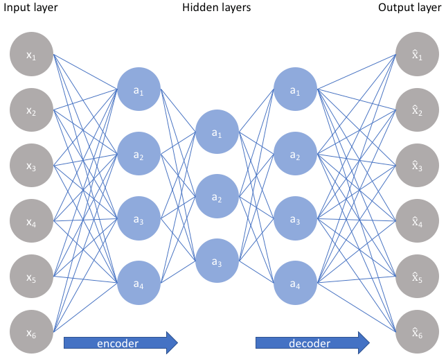

```
자기자신을 target(label) 값으로 사용하는 self supervised learning에 가까움.

Hidden layer를 coding layer, 또는 bottleneck이라고 부른다.
... Overcomplete Autoencoder: Hidden layer의 노드 수 > input 개수
... 많은 feature를 추출할 수 있어 좋아 보이지만 실제로는 그렇지 않다.
... encoding의 기능 없이 그저 input을 output까지 복사하는 문제가 생김.
... 즉, Overfitting이 발생한다는 것.
```

### Sparse autoencoder

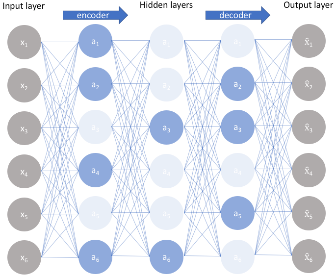

```
Sparse autoencoder: Overcomplete Autoencoder에 Dropout을 적용한 것.
... Hidden layer 중 매번 일부 node만을 사용하여 학습한다.
```

## 연구배경 및 목적

```
Autoencoder: unsupervised training model.
... 데이터 집합에 대한 representation을 학습.

DAE(Deep autoencoder): 계층적인 nonlinear mapping을 통한 효과적인 feature 학습.
... nonlinear nature 문제에 대한 solution: 구조물 건전성 관리 문제 해결법으로 많이 활용됨.
... 전통적인 ANN 기법의 진동기반 구조물 파손 탐지 모델의 성능을 넘어선 최초의 DAE 모델.

Deep sparse autoencoder model: non-sparse에 비해 noise에 강한 모델
... 대부분 모델의 MSE criterion: outliers에 민감함.
... sparseness: 유용한 feature 학습의 핵심.
```

## 제안 방법

```
Deep sparse autoencoder framework로 구조물 파손 탐지/인지.
... pattern recognition에 효과적인 모델.

3단계 구조.
... preprocessing components/dimensionality reduction component/relationship learning component.

Deep sparse autoencoder.
... dimensionality reduction component/relationship learning component 성능향상.
... noise에 강한 모델.
```

## 모델 및 데이터셋

### Deep sparse autoencoder framework

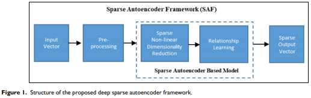

```
목적: 구조물 파손 인지.
... 구조물 파손 인지 == 구조물의 물성 변화에 따른 pattern 인식 문제.
... 경도(stiffness)에 따라 진동 특성(natural frequency & mode shape)이 바뀐다.

입력: natural frequency & mode shape.
출력: 경도(stiffness) ... 구조물 건전성 지표.

학습: 전이학습으로 전체 네트워크를 재학습.
```

### Autoencoder


```
전형적인 Autoencoder기반의 NN.
... unsupervised.
... 두 부분으로 나뉨: encoder & decoder ... 중간에 하나의 single layer.
```

### Encoder

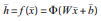

```
affine mapping에 이은 nonlinearity로 차원을 축소하는 deterministic mapping funcntion f(x_bar).

PCA(주성분 분석)과 비슷한 역할을 수행.
```

### Decoder

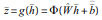

```
Encoder로 얻은 latent representation h_hat으로 input space의 z_hat을 구하는 mapping function g(h_bar).
```

```
W_hat: affine mapping weight matrix
b_bar_hat: bias vector.

W, b_bar, W_hat, b_bar_hat: cost function MSE로 최적화.

m: 샘플의 개수.
x^(i): i번째 입력.
f()/g(): Encoder/Decoder mapping function.
```

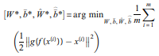

### Deep sparse autoencoder framewrok for structural damage identification

```
data 측정의 redundancy 때문에 부정확한 결과를 얻을 수 있다.
따라서 framework를 다음의 세부분으로 나눈다.
... data preprocessing/sparse nonlinear dimensionality reduction/relationship learning.
```

#### Data preprocessing

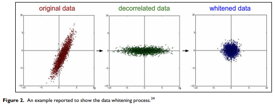

```
data whitening의 목적: 입력 데이터의 중복성과 상호 연관성을 낮추고, 변수간 분산을 맞춘다.
... whitening transform?: input vector가 white noise vector의 형태로 근사됨.
```

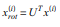

```
PCA로 도출한 orthogonal projection matrix U로 input features의 상호 연관성을 낮춘다.

x^(i): i번째 sample
```

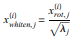

```
x_whiten,j^(j)의 PCA로 도출한 eigenvector에 대응하는 eigenvalue lambda_j로 input feature를 unit variance로 resacle한다.
```

#### Sparse dinmensionality reduction

```
Sparse dinmensionality reduction component의 목적.
... 구조물의 파손에 민감하고 불확실성과 noise에 둔감한 feature 추출.
```

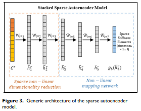

```
Sparse autoencoder에 기반한 DNN 모델은 dimensionality reduction으로 학습한다.
첫 layer: 입력(구조물의 frequencies, mode shapes)을 합성.
나머지 layer: features 압축.
```

- Sparse autoencoder

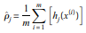

```
i번째 입력 x^(i)가 주어질 때 hidden unit j의 sparse penalty term.
... m: 샘플의 개수.
... (rho_j)_hat: hidden unit j의 activation 평균. 아래의 제약조건을 따른다.
```

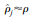

```
rho: sparsity parameter.
... 일반적으로 0에 가까운 작은 수.
... (rho_j)_hat을 0.05에 근접하게 만든다.
... 따라서 hidden unit의 activation을 0이 근접하게 만듦.
```

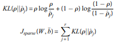

```
추가적인 penalty term: (rho_j)_hat에 대한 추가적인 regularization terem.
... KL(): rho, (rho_j)_hat의 베르누이 확률 값에 대한 Kullback-Leibler divergence.
... r: hidden layer의 뉴런 수.
... J_sparse(W,b_bar): sparse regularization term.
```

- Sparsity-inducing activation and cost function.

```
latent representation에 대한 일반적인 regularization 기법: sparse, low dimensional.

ReLU: 다른 non-sparse activation functions(tanh, sigmoid) 대비 특별한 특성을 가짐.
... information disentangling(정보 풀이).
... efficient variable-size representation(효과적인 변수크기의 표현).
... linear spearability(선형 분리).
... distributed sparsity and sparsity-induced regularization(네트워크 희소성 유도 및 희소성을 통한 규제).

단, 너무 큰 sparsity는 모델의 예측 성능을 낮춘다.
... 제안된 모델에서는 ReLU를 사용해 loss function을 재구성한다.
... sparsity-inducing term과 weight decay function 모두 사용.
```

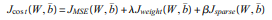

```
(J_MSE)(W, b_bar): 재구성된 loss function.
(J_weight)(W, b_bar): weight decay function(L2 regularization of all weights) ... overfitting 방지(자세한 정의은 아래 이미지 참고).
(J_sparse)(W, b_bar): sparsity penalty term(자세한 정의은 위 이미지 참고) ... 좋은 denoising 성능.
lambda, beta: regularization parameters
```

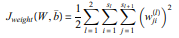

```
(w_ji)^(l): W^(l) 내 element.
s_l: l번째 layer 내 unit 개수.
```

```
Sparse autoencoder들이 쌓여 Deep architecture를 형성하고 input에 대한 robust representation을 학습.
... First layer: frequencies와 mode shapes에 대한 feature fusion 수행.
... Hidden layer: 이전 layer의 학습 내용을 압축.
... Final layer: 경도(stiffness) 파라미터를 mapping 함에 유용한 feature.

Hidden layer의 크기가 굳이 이전 layer 보다 작을 필요는 없다.
... 적절하게 동작하는 네트워크 크기를 찾는 일은 간단한 일이 아님.
... 그래서 sparsity constraint를 활용해서 모델 스스로가 학습하게함 ... objective function and ReLu(sparse activation function).
```

```
Structural natural frequencies와 mode shapes의 입력 형태는 다음과 같다.
```

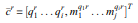

```
(q_i)^r: r번째 sample의 i번째(i = 1, ..., n) Structural natural frequency
(m_j_^(q_ir): i번째 Frequency에 대응하는 j번째(j = 1, ..., t) Mode shape 값
(c_bar)^r: 각각 t개의 Mode shape를 가지는 Frequency n개의 high dimensional(n*t) feature
... (c_bar)^r을 입력으로 받아 모델이 학습.
```

```
p번째 layer의 재구성된 loss function 정의는 다음과 같다.
```

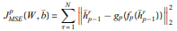

```
p = {1, ..., k}, k: dimensionality reduction component.
N: training에 참여하는 sample 개수.
g(.) and f(.): decoder and encoder function.
((h_(p-1))_bar)^r: ((h_0)_bar)^r = (c_bar)^r을 만족하는 r번째 sample의 (p-1)번째 layer의 low dimensional representation
f_p: Encoder function, ReLU로 설정.
g_p: Decoder function, pureline으로 설정.

Sparse autoencoder들의 학습에 Objective function 수식(자세한 정의는 3번째 위의 이미지 참고)을 활용.
```

#### Relationship learning

```
Relationship learning component의 목적: 압축한 features ((h_k)^r)_bar와 구조물의 경도(stiffness) 관계 파악.

activation function으로 tanh을 사용: 이 문제의 nonlinear neature를 표현해줌.
각 층의 cost function 정의는 아래와 같다.
```

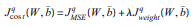

```
같은 Weight decay function(자세한 정의는 3번째 위의 이미지 참고)을 사용.

m개의 hidden layer들이 정의되고 각 층의 재구성된 loss function은 다음과 같이 정의횐다.
```

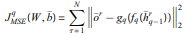

```
relationship learning component의 m번째 layer q = {k+1, ..., k+m}.
g()와 f(): decoder, encoder functions.
(h_(q-1))_bar)^r: r번째 sample의 (q-1)번째 layer에서 얻은 dimensional representation.
(o_bar)^r: r번째 샘플의 labelled ouput.
```

```
서로 다른 layer들의 global nonlinearity로 효과적인 relationship learning process가 가능.
... final joint optimization을 쌓아 global nonlinearity 효과 획득.
```

#### Training and fine-tuning of the full network

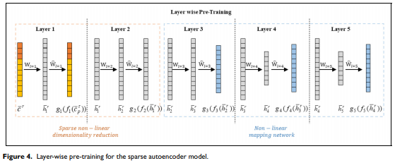

```
Sparse diemensionality reduction과 Relationship learning component가 합쳐져 모델의 네트워크를 완성.
Figure 4는 이런 Deep Neural Net의 한 예다.
... Encoding을 수행하는 처음 두 Hidden layer들은 nonlinear dimensionality를 수행하도록 pretrained 됨.
... 마지막 세 Hidden layer들은 구조물 파손 인지를 위해 compressed dimensional features와 structural stiffness parameters의 관계를 학습한다.

모델은 이렇게 학습한 robust representation과 structural stiffness reduction을 형성한다.

Figure 4의 layer-wise pre-training scheme은 vanishing gradient problem을 해결.
... Hidden layer을 one by one으로 학습해 더 효율적인 accurate training process를 만듦.
```

```
pre-training 후, 전체 neural network를 fine-tuning해서 모든 layer들을 Objective function을 사용해 동시에 최적화.
... Objective function의 정의는 다음과 같다.

p((c_bar)^r): g_L(f_L(f_(L-1)(f_(L-2)(...((c_bar)^r))))): r번째 샘플에 대한 elemental stiffness parameter output vector.
L = k+m: 전체 layer 수.
(o_bar)^r: r번째 sample의 labelled output vector.
```

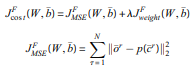

```
Sparsity-inducing term과 Relationship learning component는 각자의 역할만 수행.
... 그래서 각자의 objective function으로 학습 후 whole network에 대해 fine-tuning.
```

## 결론 및 추후논문

```
Deep sparse autoencoder framework: modal inofrmation(frequencies and mode shapes)과 Structural stiffness parameters간의 관계를 학습.
... 3가지 main components: Preprocessing/Sparse dimensionality reduction/Relationship learning.
... Sparse autoencoder 모델: Dimensionality reduction, Relationship learning component의 성능 향상.
... 이 두 Components의 jointly optimization으로 전체 Network를 성능을 높임 ... 구조물 파손 인지 성능 향상.
... Sparse regularization term: 실제로 전체 구조물의 일부분만 파손이 발생하기에 모델에 도입하여 현실을 반영.

제안한 framework의 validation: 실험실의 콘크리트 다리로 실험.
결과: 제안한 framework가 구조물 파손 인지에 있어 최신의 'AutoDNet'보다 좋은 성능을 기록.

'AutoDNet'과의 모델 비교: 효율적이고 강인한 구조물 파손 인지의 요인.
(1) Data whitening process.
(2) Sparse regularization term.
(3) More Hidden layers.

나아가 다른 vibration characteristics를 활용한 실험을 수행할 것.
```
