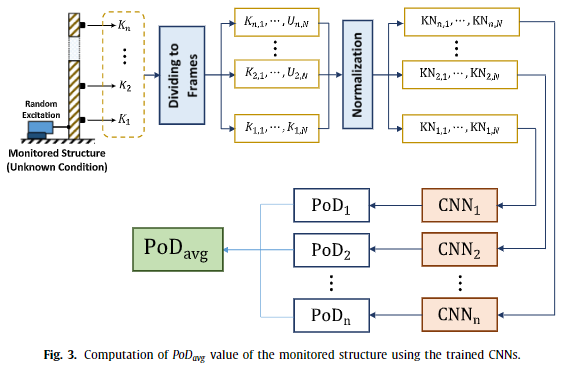

# 2020.09.21 논문 리뷰

```
논문: 1-D CNNs for structural damage detection Verification on a structural health monitoring benchmark data
저자: Osama Abdeljaber(a), Onur Avci(a,∗), Mustafa Serkan Kiranyaz(b), Boualem Boashash(b,c), Henry Sodano(d), Daniel J. Inman(d)
```

## 문제 제시

```
기존의 구조물 파손 탐지.
... ML기반: hand-crafted feature extraction & classification.
... 데이터와 분석 방법에 따라 상이한 결과.

CNNs기반의 구조물 파손 탐지.
... feature extraction과 classification을 함께 학습.
... 성능과 계산효율 모두 상승시키는 효과.

1-D CNNs: vibration-based 구조물 파손 탐지에서 SOTA.
... 하지만 학습에 큰 구조물에 대한 엄청난 데이터 측정치양이 필요함.

이 논문에서는 구조물의 크기와 관계없이 오직 두가지 측정치만 있으면 잘 동작하는 CNN-기반 접근을 제시한다.
```

## 최근 연구동향

```
1D & 2D CNNs: 기존 구조물 파손 탐지 기법에 비해 월등히 좋은 성능.
... 정확도, 속도 양 측면 모두.
... feature extraction과 damage classification을 한번에 수행.

최근의 1D CNNs (Non parametric) 구조물 파손 탐지.
... 실험실규모의 구조물 환경.
... 매우 작은 파손(느슨한 나사조임)을 탐지하는 기술.
... 각 1D CNN은 구조물의 각 관절(연결부)에 할당.
... 각 관절에서 측정치를 입력으로 받아 1D CNN에서 각 관절을 파손 여부를 평가.

모든 1D CNN을 학습시키기 위해 엄청난 양의 데이터가 필요함.
... 1. 모든 관절이 undamaged인 상태를 측정.
... 2. 관절 중 하나씩 damaged된 상태를 측정. 
... 실험결과, CNN 기반 파손 탐지 시스템이 관절의 파손을 실시간으로 잘 관측해낸다.
데이터 수집에 있어 그 양과 경우가 많아 도심의 큰 건물의 경우 사실상 측정이 불가하다.
```

## 1. Introduction

```
주요 Contribution:
1. 기존 ML의 구조물 파손 탐지 방안들과 달리 raw vibration을 바로 입력받아 처리.
... data preprocessing, manual feature extraction이 필요없다.

2. 1D-CNNs = feature extraction + classification.
... 실시간 구조물 파손 탐지가 가능할 정도로 계산량을 줄인다.
... 추출한 feature에 꼭 맞는 classification을 수행하여 정확도를 높인다.

3. 강화된 CNN 기반 구조물 파손 탐지 방안: 데이터셋 크기에 관계없이 오직 두개의 측정치만 요구.
... 기존 1D-CNNs이 요구한 막대한 양의 데이터셋을 해결.
```

```
실험 데이터셋: Expherimental pahse II of the structural health monitoring benchmark problem by IASC-ASCE Structural Health Monitoring Task Goupin 2003.
... 전 세계적인 구조물 파손 탐지 방안들에게 동일한 실험환경을 제공하기 위한 데이테셋.
```

## 2. Adaptive 1D CNNs

```
이 논문에서는 1D CNN과 tanh를 사용한다.
... tanh: highly dynamic and noisy 정보를 학습하기에 적절함.
```

- 1D CNNs의 두가지 layers

```
1) 1D convolution과 sub-sampling이 모두 발생하는 CNN-layer
2) standard MLP의 hidden and output layer와 유사한 MLP layer
```

- 1D CNN layer foward propagation


```
(x^l)_i: input
(n^l)_k: layer l에서 kth 뉴런의 bias
(s^(l-1))_i: layer l-1에서 ith 뉴런
(w^(l-1))_ik: layer l-1에서 i -> k의 파라미터
```

## 3. The proposed approach for structural damage estimation

- 데이터 전처리

```
1D CNNs은 vibration 기반 구조물 파손 탐지분야의 최신 기술.
... 높은 정확도.
... 실시간 시스템.
... SHM 응용에 적합한 솔루션.

전체 구조물에 n개의 측정장치가 있다고 할때,
1. 손상이 없는 구조물을 측정한 데이터셋.
2. 완전히 손상된 구조물을 측정한 데이터셋.
이 두가지 데이터 셋만 측정한다.
단, '손상'의 의미는 탐지하려는 손상에 따라 달라진다.
... 만일 연결의 정도를 탐지한다면,
... 데이터셋1 U: 모든 나사가 조여진(intact) 구조물에 대한 측정치.
... 데이터셋2 D: 모든 나사가 풀린(loosend) 구조물에 대한 측정치.
```


```
각 U_i가 n_u개의 샘플로, D_i가 n_d개의 데이터 포인트가 있을때, 다음과 같이 데이터를 샘플링한다.
... N_u = n_u/n_s
... N_d = n_d/n_s
```


```
네트워크 학습에 앞서 U_i & D_i의 각 프레임을 -1 ~ 1로 정규화하고 효율적인 학습을 위해 shuffle한다.
```


- 1D CNNs(각 측정기에 배치된 1D CNN들) 학습구조


```
데이터 전처리를 마치고, UNS_i와 DNS_i로 1D-CNN_i을 학습한다.
... 위의 학습과정을 마치면 손상의 크기와 상관없이 모든 구조물의 손상을 탐지할 수 있다.
```

- 구조물의 전반적인 상태를 대변하는 PoD 계산

```
1. 각 CNN 결과를 기록.
```


```
2. K의 N_k개의 요소 K_i는 각각 n_s의 샘플로 구성.
... CNN 훈련과정에서 같은 수의 샘플들이 사용됐기 때문.
```


```
3. K_i를 정규화.
```


```
4. KN_i로 CNN_i를 학습.

5. classifier CNN_i는 KN_i를 받아 undamaged/fully damaged를 판단 ... PoD_i를 계산한다.
... N_r,i[0 N]: KN_i 내 fully damaged로 판단된 프레임 수.
... PoD: 0에 가까울 수록 undamaged case, 100에 가까울 수록 fully damaged cas.
```


```
6. 전체 구조물의 PoD_avg를 계산.
```


- PoD_avg 계산 구조



## 4. 결론

```
1. 1D CNN 알고리즘의 PoD 도출은 성공적.

2. 필요한 데이터셋의 크기를 상당히 줄임.

3. unseen data를 완벽히 예측할 수 있는 전무한 모델.

4. 차후 damage의 위치를 찾는 연구를 수행할 예정.

5. 차후 실제 damage에 의한 측정값으로 실험할 예정.

6. 실험 결과값은 미래 연구를 위해 benchmark data로 공개.
```

- benchmark data: <http://www.structuraldamagedetection.com/>