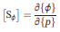

# 2020.10.05 논문 리뷰

```
논문: structural damage detection based on l1 regularization using natural frequencied nad mod shapes
저자: Rongrong Hou, Yong Xia, Xiaoqing Zhou
```


## 관련연구

## 배경지식

### Tikhonov regularization(티호노프 정규화)

```
통계학에서는 능선회귀(Ridge regression)이나 능형회귀라고 부른다.
최근 딥러닝에서는 L2 정규화(L2 regularization)라고도 부른다.

기본적으로는 가중치의 제곱의 합을 목적함수에 더한다.
```

### Norm(벡터의 크기)


```
수학적 정의는 복잡하지만, 결국 어떤 값의 크기를 계산하여 비교가 가능하게끔 하는 함수.
```

### L1 regularizaiton(Manhattan distance, Taxicab geometry)

```
L1 Norm은 두 벡터를 빼고 절대랎을 취한 뒤, 합한 것.
예를 들어 x=(1,2,3), y=(-1,2,4) 일 때, d(x,y)=|1-(-1)|+|2-(2)|+|3-(4)|=2+0+1=3이다.
```

### L2 regularizaiton(Euclidean distance)

```
L2 Norm은 두 벹어의 각 원소의 차를 제곱하여 합한 값에 루트를 씌운 것.
예를 들어 x=(1,2,3), y=(-1,2,4) 일 때, d(x, y)=root(4+0+1)=root(5)이다.
좌표 상 두 점사이의 직선거리와 동일.
```

### L1 Norm과 L2 Norm의 직관적인 차이


```
위 그림은 벡터 사이의 거리를 재는 서로 다른 Norm을 표기한 것.
여기서 초록색 선이 우리가 가장 잘 알고있는 Euclidean distance, 즉 L2 Norm. 단 한 경우만 존재함.
하지만 나머지 모든 경우가 L1 Norm. 이런 시각적 특성 때문에 Taxicab geometry라고도 불림.
```

### Loss Function


```
L1 Loss.
... L1 Norm의 두 벡터가 실제 타겟값(y_true)과 예측 타겟값(y_pred)으로 들어갔을 뿐.
... LAD(Least Absolute Deviations), LAE(Least Absolute Errors), LAV(Least Absolute Value), LAR(Least Absolute Residual) 등으로 불림.
... L2 Loss에 비해 이상치(Outlier)의 영향을 덜 받는, Robust한 특성으 가짐.
... 0에서 미분이 불가능함.
```


```
L2 Loss.
... L1 Loss와 별반 다를 것 없지만 마지막에 루트를 취하지 않음 ... 이에 LSE(Least Sqaures Error, 최소자승법)이라고도 불림.
... 두 값의 절대값을 계산하던 L1 Loss와 달리 L2 Loss는 제곱을 취하기에, 이상치가 들어오면 오차가 제곱이 되어 이상치에 더 영향을 받음.
... 때문에 이상치가 있는 경우 적용하기 힘든 방법론.
```

### Loss 별 특성 요약

```
L1 Loss.
... Robust.
... Unstable solution.
... Possibly multiple solution.

L2 Loss.
... Not very robust.
... Stable solution.
... Always one solution.
```

### Regularization(정규화)


```
모델의 과적합(Overfitting)을 줄여 General하게 만드는 것.
모델의 일반화 성능을 높이는 방법론 중 하나.
... Data augmentation, Ensemble model, Dropout, Dropconnect, Batch normalization, Early stopping, Weight decay, Multi-Task Learning 등.

Regularization은 로우한 개념으로 모델의 Weight matrix를 좋은 방향으로 업데이트 해 나가는 것.
... 이 Weight 중 일부가 학습과정 중 과도하게 커져버리면 몇몇 인풋에 극단적으로 의존하게 되고 일반화 성능이 감소.
... 때문에 특정 Weight 값이 과도하게 커지지 않게끔 방해하는 역할을 수행.
```

```
L1 Regularization.
... L1 Loss에 Regularization Term을 붙인 것.
... 기존 Loss에 절대값 만큼의 페널티를 달아 Cost가 커지게 만들어 모델 Weight의 과도한 변화를 막는다는 느낌.
... lambda는 정규화 적용 비율.
... Sparse feature에 의존한 모델에 L1 Regularization을 적용하면 불필요한 Feature에 대응하는 Weight를 0으로 만들어 Feature selection의 효과를 냄.
... L1 Regularization을 사용하는 선형 회귀 모델을 Lasso model이라고 함.
```

```
L2 Regularization.
... L2 Loss에 Regularization Term을 붙여 만듦.
... 다만 불필요한 Feature(이상치)에 대응하는 Weight를 0에 가깝게 만들 뿐, 0으로 만들지는 않음.
... 강하게 밀어붙이는 L1 Regularization에 반해 L2 Regularization은 선형 모델의 일반화 능력을 향상 개선시킴.
... L2 Regularization을 사용하는 선형 회귀 모델을 Ridge model이라고 함.
```


## 연구배경 및 목적

```
L1 Regularization 기반의 구조물 파손 예측 모델 업데이팅 방법.
... 진동 기반 구조물 파손 인지 모델들은 Tikhonov(L2) Regularization을 일반적으로 사용해 왔다.
... 허나 L2 Regularization은 Smooth(이상치에 약한) solution을 만든다.
... 이는 실제 구조물 파손의 sparsity senario를 표현하는데 한계가 있다.
... 때문에 본 논문에서는 L1 Regularization을 활용해 모델을 업데이트하는 방법을 제시한다.
```

## 제안 방법

### Sensitivity-based model updating


```
Sensitivity-based model updating: 실험값과 에측값의 불일치를 최소화하는 구조물 parameter 변화를 찾아내는 일.
구조물은 파손 전 후로 선형적으로 동작함을 가정하고 파손 parameter {p}와 modal parameter 변화량 {ΔR}을 위와 같이 표현.
... {R^E}와 {R^0}: 측정된 modal parameters와 analytical one.
... [S]: Sensitivity matrix ... damage parameter에 대한 modal parameter의 변화량.
```




```
{λ}와 {ϕ}: eigenvalues와 eigenvectors.

[S]:  global finite element(FE) model, substructuring approach 모두로 계산 가능.
```


```
 == 
```


```
damage parameters {p}를 구하는 optimization problem.
... {R(p)}: analytical modal parameters.

noise input에 의한 심각한 변화를 해결하기 위해 Tikhonov regularization이 model updating에 사용됨.
... 아래의 그림과 같이 regularization term이 목적 함수에 더해짐.
```


```
(||{p}||_2)^2: regularizaiton term or soltuion norm ... solution을 quantifying.
β(> 0): regularization parameter ... 문제에 기반해 결정.
```

### Sparse damage detection using frequencies and mode shapes


```
구조물 stiffness matrix.
... [K^i]: i번째 stiffness matrix.
... a_i: element stiffness parameter.

기존의 연구: 파손 발생 시 mass의 변화 없이 stiffness에 큰 변화가 발생할 것이다고 가정.
... 파손 발생 후 stiffness를 (a_i)^~으로 둘 때, damaged state는 다음의 형태.
```


```
SRF(stiffness reduction factor, p_i): 본 논문에서 선택한 damage parameter.
... SRF의 값은 damage location과 damage severity 모두를 지칭함.
... {p}: damage location에 non-zero item들이 있는 sparse vector.
... p_i = 0: i번째 element가 intact함을 표시.
... p_i = -1: i번째 element가 완전히 파손됨을 표시.

기존 연구에서 활용한 L2 regualrization이 아닌 L1 regularzation을 활용하는 이유.
... ill-posed problem의 stabilize와 solution의 sparsity 강화.
```


```
위의 목적함수가 convex 하지만 미분가능하지 않다.
그래서 이를 바탕으로 optimization을 다시 구성.
... natural frequencies와 mode shapes를 구조물 파손 탐지 모델에 활용.
```


```
{λ_i}와 {ϕ_ji}: i번째 eigenvalues, 그리고 대응하는 j번째의 mode shape.
m: 측정된 mode 갯수.
np: 측정 위치 갯수.
... n: FE model 요소 갯수.
A와 E: analytical model과 experiment의 item.

eigenvalue residual, eigenvector residual, regularization term을 veoctr의 길이로 나누어 비교가능하게 만듦.
... i.e.) m, m*np, n.
```


```
mode shapes는 차원이 없고 그 크기가 다 다르기에 비교가 불가하다.
... FE 모델에서는 위의 식으로 mode shapes의 방향과 크기를 맞춰준다.
... {(ϕ_i)^~A}: adjustment 이전에 계산된 i번째 mode shape. 
```

### Selection of regularization parameter

```
Optimization problem에서 중요한 문제가 regularization parmameter β의 값이다.
... β의 크기에 의해 data fidelity와 sparsity가 결정됨.
... 적절한 β를 찾아 data fidelity와 sparsity를 모두 최소화시켜, 전체 Loss 값을 낮춰야한다.
```

## 모델 및 데이터셋

### Model description


```
선행 연구: natural frequencies는 1%의 noise를, mode shape에는 8~10%의 noise를 포함.
noise에 대한 damage detection accuracy를 확인하기 위해 2단계의 noise level을 설정.
```


### Using noise-free modal data

```
우선 어떤 noise도 없는 modal data로 실험.

목적함수의 적절한 β값을 탐색.
... 0.005 ~ 1.0사이를 Δβ = 0.005로 실험하며 확인.
```


```
β≥0.375 일 때, solution norm = 0 ... 어떤 파손도 탐지해내지 못함.
... β_max=0.375: 의미있는 결과를 얻기위한 maximal regularization parameter value.
... β < β_max를 만족해야만 한다!

β=0.005부터 지속적으로 residual norm이 증가.
... noise가 없는 경우, β_optimial=0.005.
```


```
β에 따른 파손 탐지 결과.
... β=0: 3개의 파손 결과 검출, 파손 정도는 정확하지 않음.
... β=0.10: 탐지 accuracy는 여전히 괜찮은 수준.
... β=0.33: 파손 위치는 명확하지만 파손 정도는 틀리다.
... β=0.005~0.20: 만족할 수 있는 결과 도출.
```

### Using modal data of noise level 1


```
목적함수의 적절한 β값을 탐색.
... 0.005 ~ 1.0사이를 Δβ = 0.005로 실험하며 확인.
... 초반, β가 커지면서 solution norm이 빠르게 감소.
... β=0.03~-2.0에서 완만하게 감소하다가 β=0.35까지 다시 가파르게 감소.
... β_opitmal=0.03.
```


```
β에 따른 파손 탐지 결과.
... β=0.03: 파손 위치와 크기 모두 정확.
... β=0.15: 파손위치만 정확. 용인할 수 있는 정도.
... β=0.30: 파손위치는 맞지만 용인할 수 없는 수준의 오차.
```

### Using modal data of noise level 2


```
목적함수의 적절한 β값을 탐색.
... 0.005 ~ 1.0사이를 Δβ = 0.005로 실험하며 확인.
... 초반, β가 커지면서 solution norm이 빠르게 감소.
... β_opitmal=0.055.
```


```
L1 regularization기반의 구조물 파손 탐지 모델 실험 결과.
... 파손 위치와 정도 파악에 효과적.
.., noise에 robustness.
```

## 결론 및 추후논문

```
L1 regularization의 sparse weight matrix를 통해 구조물 파손에 적절한 모델을 구축.

차후엔 보다 실질적인 구조물을 대상으로 실험할 것.
```