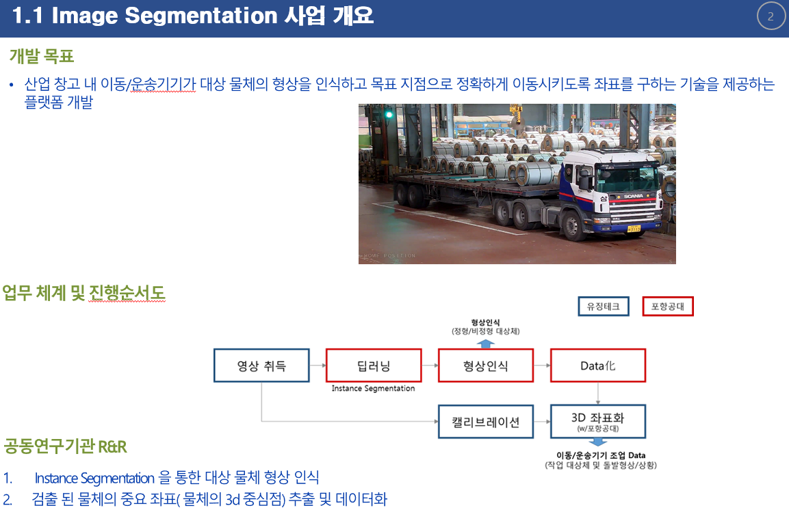
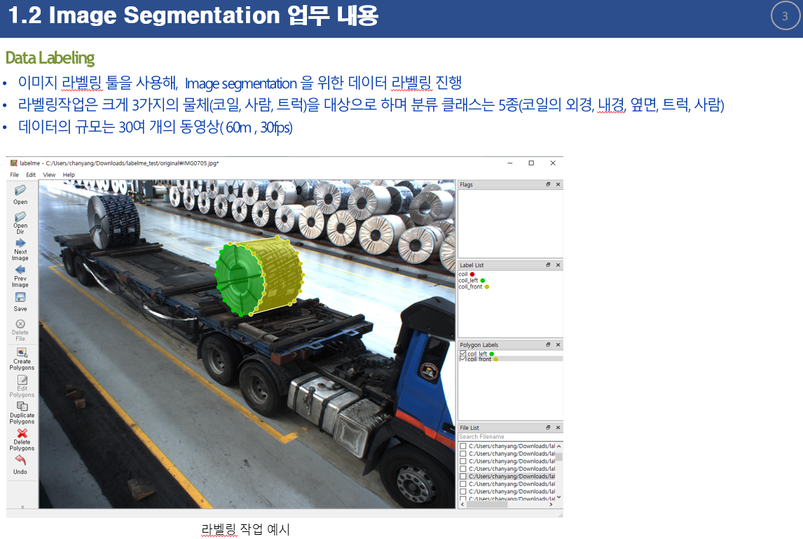
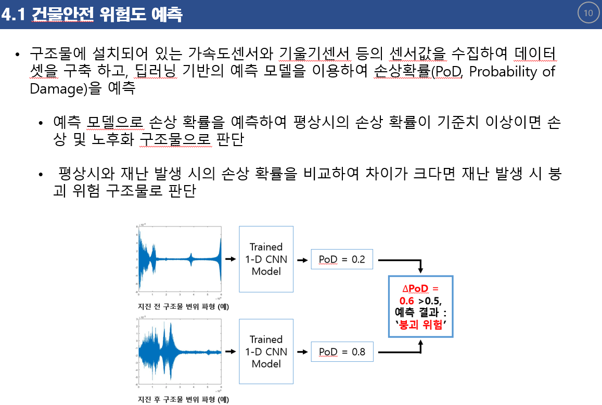
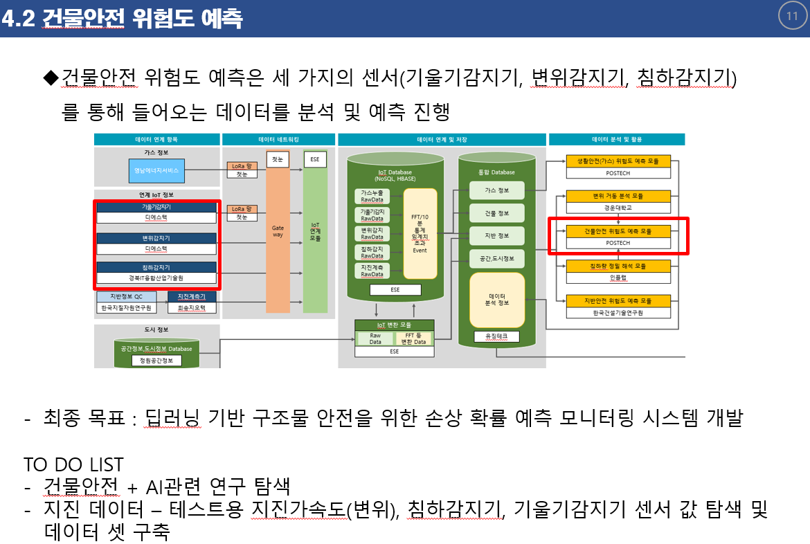

# 20.09.18: OT

## 0. 업무배정
- 인턴 공동과제: Image Segmentation Labeling



```
개발 목표
... 산업 창고 내 이동/운송기기(크레인)가 대상 물체의 형상을 인식하고 목표 지점으로 정확하게 이동시키도록 좌표를 구하는 기술을 제공하는 플랫폼 개발.

업무 체계 및 진행 순서도.
... 유징테크와 협업하면서 우리 포항공대는 연구부는 (딥러닝 -> 형상인식 -> 데이터화) 파트를 진행.
```



```
Image Segmentation 업무 내용.
... 이미지 라벨링 툴을 사용해, Image segmentation을 위한 데이터 라벨링 진행.
... 라벨링 작업: 크게 3가지 물체(코일, 사람, 트럭)을 대상.
... 분류 클래스: 5종(코일의 외경, 내경, 옆면, 트럭, 사람).
... 데이터 규모: 60분, 30fps.
```

- 단독 과제: 건물안전 위험도 예측





```
개발 목표.
... 구조물의 센서(가속도센서와 기울기센서)값들을 수집하여 데이터셋을 구축.
... 딥러닝 기반의 예측모델을 이용하여 손상확률(PoD, Probability of Damage)를 예측.
... 예측 모델의 손상확률을 예측하여 평상시의 손상 확률이 기준치 이상이면 손상 및 노후화 구조물로 판단.
... 평상시와 재난 발생시의 손상 확률을 비교하여 차이가 크다면 재난 발생 시 분괴 위험 구조물로 판단.

건물안전 위험도 예측.
... 입력: 세가지 센서(기울기감지기, 변위감지기, 침하감지기).
... 출력: 손상확률(PoD).
... 최종 목표: 딥러닝 기반 구조물 안전을 위한 손상 확률 예측 모니터링 시스템 개발.

To Do List.
... 건물안전 + AI 관련 연구 탐색.
... 지진 데이터셋 구축 ... 테스트용 지진가속도(변위), 침하감지기, 기울기감지기 센서 값 탐색 및 데이터셋 구축
```

