# 2020.10.06 논문 리뷰

```
논문: Comparative Analysis of Total Station Measuring Inclination and Settlement
저자: Youliang Wang
```

---

## 배경지식

### total station

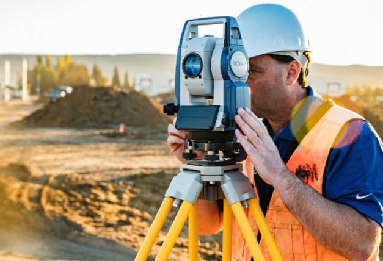

```
토탈 스테이션: 수직 및 수평 각도와 기기에서 특정 지점까지의 경사거리를 측정하기 위한 전자 거리 측정 기기.
```

---

## 연구배경 및 목적

### settlement measurement 데이터를 활용해 간접적으로 건물의 inclination 측정 방법 제시

```
2016.6~2018.07 고층 빌딩의 관측 데이터와 전체 station의 tilt 관측 데이터 활용.

prism없이 건축물의 기울기 변형을 측정하는 방법을 제시.
... level measuring settlement에서 plane regression을 활용하여 계산. 
```

---

## 제안 방법

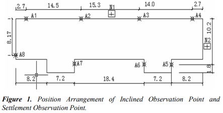

```
관측 건물 정보.
... 11개의 고층 건출물에 대해 관측.

settlement 관측 정보.
... 빌딩의 둘레를 따라 센서들을 설치.
... 각 위치에 따라 A1부터 A8로 명명.
```

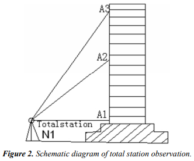

```
건축물 tilt 관측 정보.
... figure 1의 N1, N2 포인트: 동서 방향의 tilt 관측.
... 수직 선상의 A1, A2, A3 포인트: 남북 방향의 tilt 관측.
```

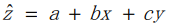

```
각 층의 높이를 센서값으로 도출.
... z: height.
... (x, y): 센서값.
```

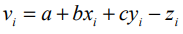

```
평면 v_i를 예측하기 위해 최소자승법 활용.
```

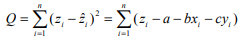

```
각 층의 평면의 식을 표현하는 일반식으로 확장.
```

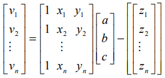

```
각 평면의 법선 벡터로 tilt값 도출.
... 정규화하여 비교.
```

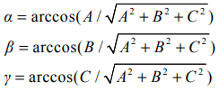

---

## 모델 및 데이터셋

### 데이터셋

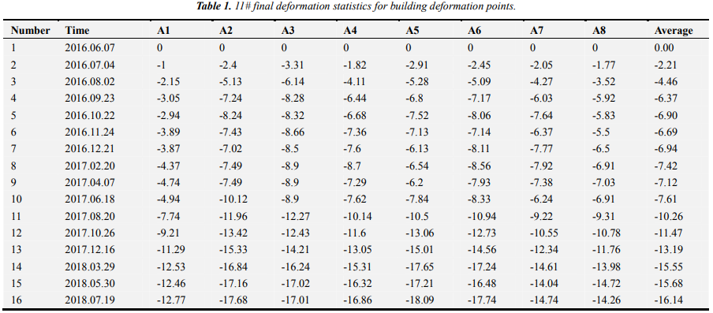

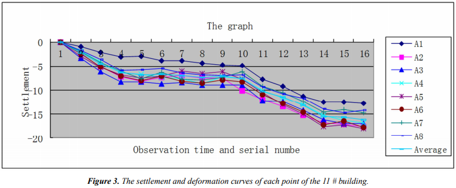

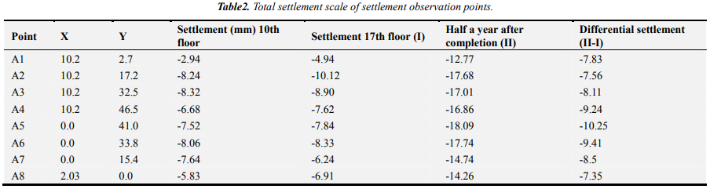

```
11개의 구조물에 대해 2달 주기로 24달 간 측정.
... 위의 정보는 16층의 건물에 대한 settlement 측정치.
... 아래 통계에서 확인 가능하듯, deformation으로 각 층이 점차 낮아짐.
... 구조물 변형 측정 규정에 따르면 100일간 settlement 변화량이 0.01~0.04mm/d보다 작을 때 stable stage로 판단.
```

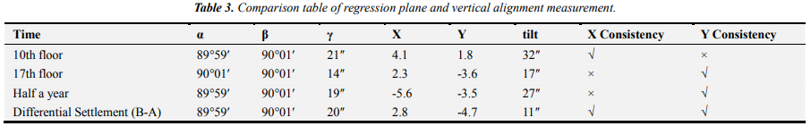

```
위 센서값으로 도출한 평면의 법선 벡터로 기울기를 확인할 수 있다.

Consistency 유무의 원인.
... 1. 침하는 되지만 기울기는 발생하지 않는 경우.
... 2. 실시간 측정에 의한 오차.

해당 건물은 기울기의 변화가 발생하지 않음.
```

---
## 결론 및 추후논문

```
이 방법으로 효율적으로 기울기를 측정하고 건물의 변형을 확인할 수 있다.

나아가 GPS, image 측정, 동적 모니터링 방법들을 활용해볼 것이다.
```

---